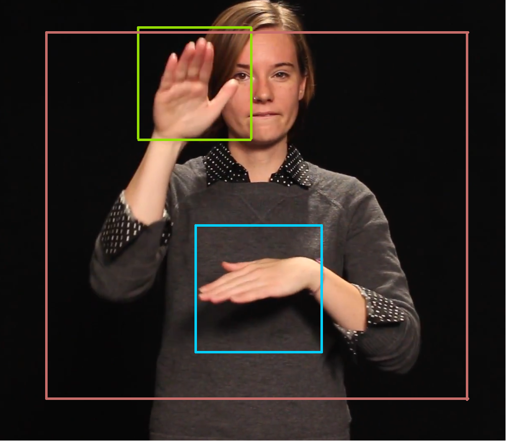

# Alphabet Sign Language Recognition

## Project Overview
Project áp học máy để nhận diện ngôn ngữ ký hiệu bảng chữ cái tiếng anh (phạm vi là các chữ cái tĩnh), sử dụng mạng truyền thẳng MLPClassifier.

## Project Structure

```
├── data/
│   ├── dataset/
|   |    |─── A/
|   |    |   |── img1.jpg
|   |    |   |── ...
|   |    |   └── img2.jpg
|   |    |─── B/
|   |    |─── ...
|   |    └─── Z/
│   ├── create_data.ipynb    
│   ├── DATASET.pickle   
│   ├── utils.py         
│   └── main.ipynb       
├── model/
│   ├── attention.py     
│   └── model.py        
├── out-checkpoints/    
├── environment.yml     
├── main.ipynb        
├── train.py         
├── train_libs.py     
└── test_libs.py    
```

## Setup and Installation

1. Clone the repository:
```bash
git clone https://github.com/HuuTuan180404/AlphabetSignLanguageRecognition.git
cd AlphabetSignLanguageRecognition
```

2. Create and activate the conda environment:
```bash
conda env create -f environment.yml
conda activate <environment_name>
```

## Usage

1. **Data Preparation**:
   - Chuẩn hóa dữ liệu: dữ liệu được chuẩn hóa tỷ lệ theo bounding box của bàn tay.
   

2. **Training**:
3. **Testing and Real-time Recognition**:
   - Tôi có để 1 file model để test
   - Kích hoạt môi trường:
   ```bash
   conda activate alphabetic
   ```
   - Chạy realtime:
   ```bash
   python test_libs.py
   ```
   - Hoạt động:
     - Mở camera
     - Nhận diện bàn tay
     - Dùng mediapipe nhận diện các điểm mốc bàn tay
     - Phân loại ký hiệu
     - Nhấn 'Esc' để thoát chương trình
   
## Contributors

- HuuTuan180404 (nguyenhuutuan1704@gmail.com)
